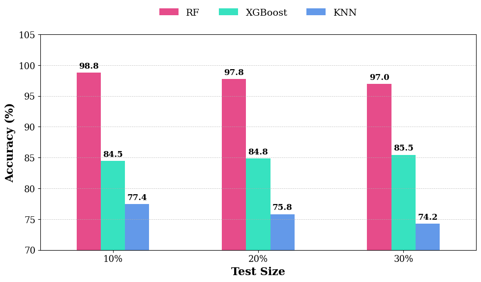
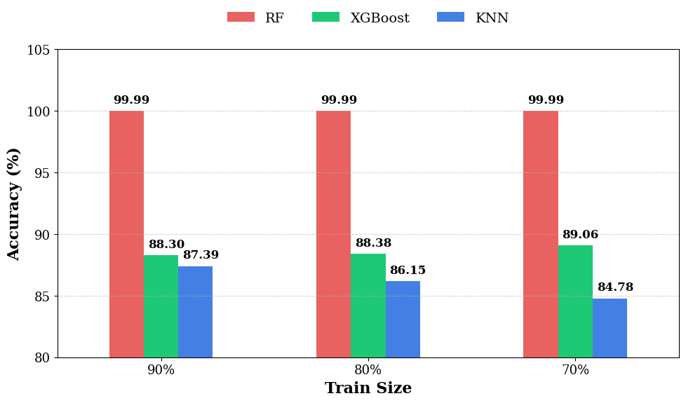
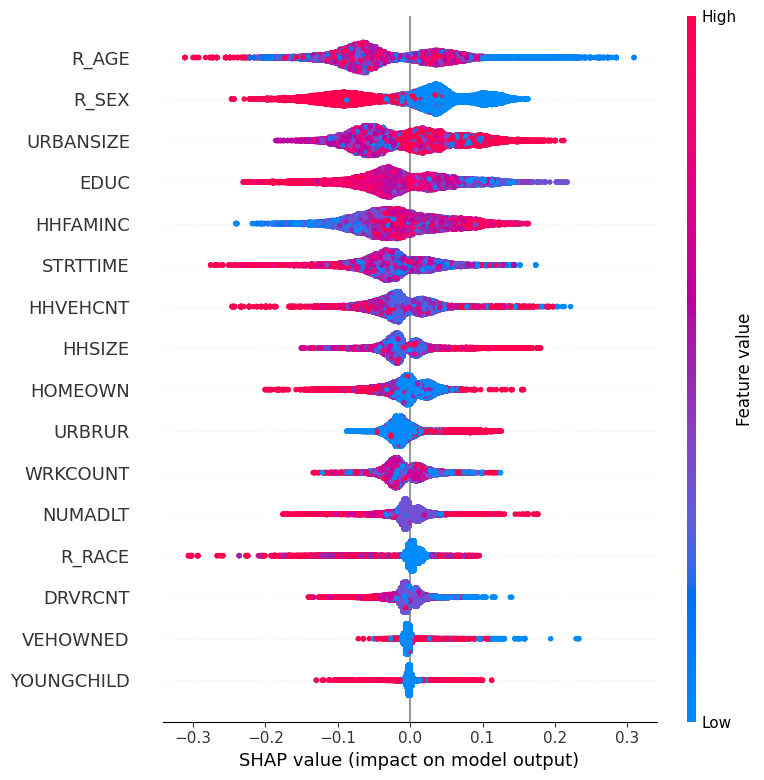
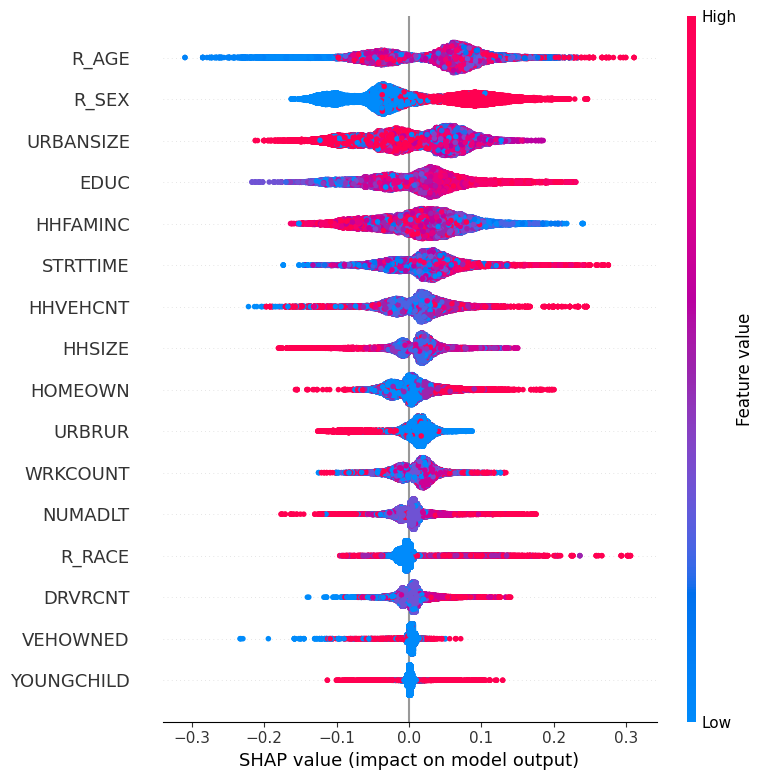

# Explainable Machine Learning for Understanding Trip Mode Choice: Evidence from the 2022 U.S. National Household Travel Survey
Understanding why people choose public or private transport is essential for solving congestion, emissions, and access challenges. Using data from the 2022 National Household Travel Survey, this study builds and evaluates three machine learning models KNN, Random Forest, and XGBoost to predict individual mode choice. Model performance is assessed through accuracy and ROC AUC, then ranked for robustness. SHAP analysis exposes the variables that most strongly shape decisions, giving transparent insight into behavioral drivers. The results show that machine learning can reliably forecast mode choice and provide planners with evidence to design more sustainable and congestion reducing mobility strategies.
# Methodology

# Result

**Average Accuracy, AUC, and Total Ranking for Models**

| Model | Avg Train Accuracy (%) | Avg Test Accuracy (%) | Avg Train AUC | Avg Test AUC | Train Acc Rank | Test Acc Rank | Train AUC Rank | Test AUC Rank | Total Rank |
|-------|--------------------------|--------------------------|---------------|---------------|----------------|----------------|----------------|----------------|-------------|
| RF    | 99.996                  | 97.384                   | 0.999998      | 0.996346      | 1              | 1              | 1              | 1              | 4           |
| KNN   | 92.709                  | 87.035                   | 0.982292      | 0.938390      | 2              | 2              | 2              | 2              | 8           |
| XGB   | 88.580                  | 84.915                   | 0.955565      | 0.916886      | 3              | 3              | 3              | 3              | 12          |

<table>
  <tr>
    <td align="center">
       
      <em>SHAP summary plot for public transport usage, illustrating the influence of various features on predictions. </em>
    </td>
    <td align="center">
       
      <em>SHAP summary plot for private transport usage, illustrating the influence of various features on predictions.</em>
    </td>
  </tr>
</table>

